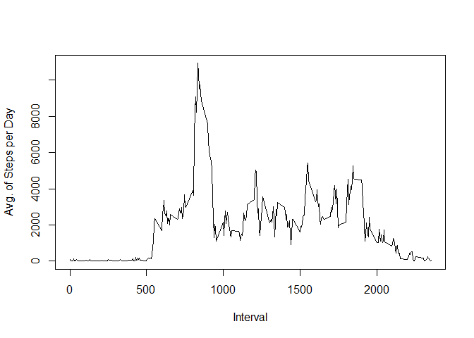

# Reproducible Research: Peer Assessment 1


## Loading and preprocessing the data

```r
activity = read.csv("activity.csv")
```

## What is mean total number of steps taken per day?
Total Number of steps:

```r
sum(activity$steps, na.rm=TRUE)
```

```
## [1] 570608
```

Total Number of steps taken each day:

```r
x <- aggregate(activity$steps, by=list(activity$date), FUN=sum, na.rm=TRUE)
print(x)
```

```
##       Group.1     x
## 1  2012-10-01     0
## 2  2012-10-02   126
## 3  2012-10-03 11352
## 4  2012-10-04 12116
## 5  2012-10-05 13294
## 6  2012-10-06 15420
## 7  2012-10-07 11015
## 8  2012-10-08     0
## 9  2012-10-09 12811
## 10 2012-10-10  9900
## 11 2012-10-11 10304
## 12 2012-10-12 17382
## 13 2012-10-13 12426
## 14 2012-10-14 15098
## 15 2012-10-15 10139
## 16 2012-10-16 15084
## 17 2012-10-17 13452
## 18 2012-10-18 10056
## 19 2012-10-19 11829
## 20 2012-10-20 10395
## 21 2012-10-21  8821
## 22 2012-10-22 13460
## 23 2012-10-23  8918
## 24 2012-10-24  8355
## 25 2012-10-25  2492
## 26 2012-10-26  6778
## 27 2012-10-27 10119
## 28 2012-10-28 11458
## 29 2012-10-29  5018
## 30 2012-10-30  9819
## 31 2012-10-31 15414
## 32 2012-11-01     0
## 33 2012-11-02 10600
## 34 2012-11-03 10571
## 35 2012-11-04     0
## 36 2012-11-05 10439
## 37 2012-11-06  8334
## 38 2012-11-07 12883
## 39 2012-11-08  3219
## 40 2012-11-09     0
## 41 2012-11-10     0
## 42 2012-11-11 12608
## 43 2012-11-12 10765
## 44 2012-11-13  7336
## 45 2012-11-14     0
## 46 2012-11-15    41
## 47 2012-11-16  5441
## 48 2012-11-17 14339
## 49 2012-11-18 15110
## 50 2012-11-19  8841
## 51 2012-11-20  4472
## 52 2012-11-21 12787
## 53 2012-11-22 20427
## 54 2012-11-23 21194
## 55 2012-11-24 14478
## 56 2012-11-25 11834
## 57 2012-11-26 11162
## 58 2012-11-27 13646
## 59 2012-11-28 10183
## 60 2012-11-29  7047
## 61 2012-11-30     0
```

Histogram of the total Steps taken each day

```r
hist(x$x, xlab = "Steps", main = "Steps taken each day", col = "azure")
```


Mean  and Median of the total number of steps taken each day:

```r
mean(x$x); median(x$x)
```

```
## [1] 9354.23
```

```
## [1] 10395
```

## What is the average daily activity pattern?
Time Series Plot with the Average number of steps taken by Interval across all dates:

```r
t <- aggregate(activity$steps, by=list(activity$interval), FUN=sum, na.rm=TRUE)
plot(t$Group.1, t$x, type = "l", xlab="Interval", ylab="Avg. of Steps per Day")
```



Interval with the Maximum number of steps in average

```r
t$Group.1[t$x==max(t$x)]
```

```
## [1] 835
```

## Imputing missing values
Total number of Missing Values:

```r
length(which(is.na(activity$steps)))
```

```
## [1] 2304
```
Rows with missing values are removed from the dataframe:

```r
activityWithoutNA <- activity[complete.cases(activity),]
```

Histogram of the total Steps taken each day:

```r
x2 <- aggregate(activityWithoutNA$steps, by=list(activityWithoutNA$date), FUN=sum)
hist(x2$x, xlab = "Steps", main = "Steps taken each day", col = "azure")
```


Mean  and Median of the total number of steps taken each day:

```r
mean(x2$x); median(x2$x)
```

```
## [1] 10766.19
```

```
## [1] 10765
```

## Are there differences in activity patterns between weekdays and weekends?
Factor Variable that specifies the name of the weekday

```r
activityWithoutNA$weekday  <- as.factor(weekdays(strptime(activityWithoutNA$date, "%Y-%m-%d")))
```

time series plots for Weekdays and Weekends:

```r
par(mfrow = c(2,1))
activityWithoutNAWeekDay <- activityWithoutNA[!(activityWithoutNA$weekday %in% c("Saturday","Sunday")),]
activityWithoutNAWeekEnd <- activityWithoutNA[activityWithoutNA$weekday %in% c("Saturday","Sunday"),]
t2 <- aggregate(activityWithoutNAWeekDay$steps, by=list(activityWithoutNAWeekDay$interval), FUN=sum)
t3 <- aggregate(activityWithoutNAWeekEnd$steps, by=list(activityWithoutNAWeekEnd$interval), FUN=sum)
plot(t2$Group.1, t2$x, type = "l", xlab="Interval", ylab="Number of Steps", main = "Weekdays")
plot(t3$Group.1, t3$x, type = "l", xlab="Interval", ylab="Number of Steps", main = "Weekends")
```


